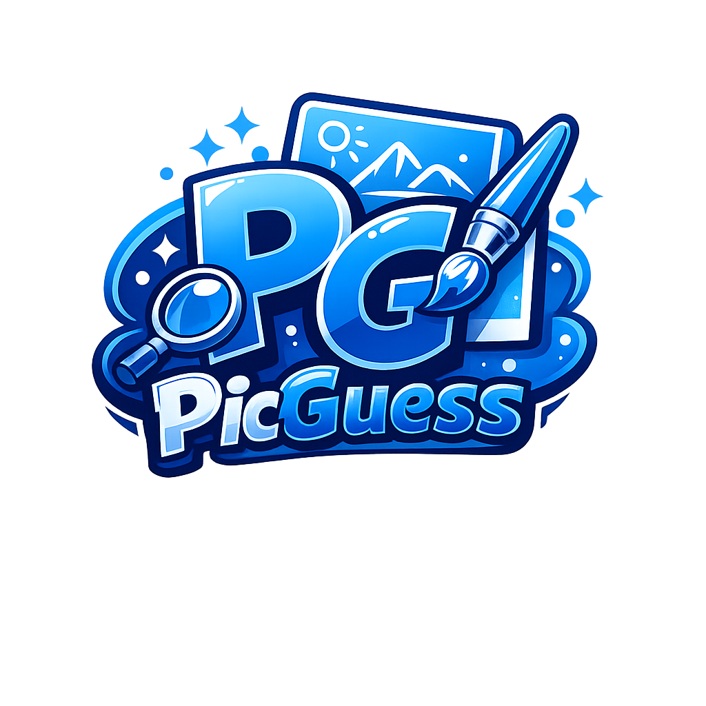
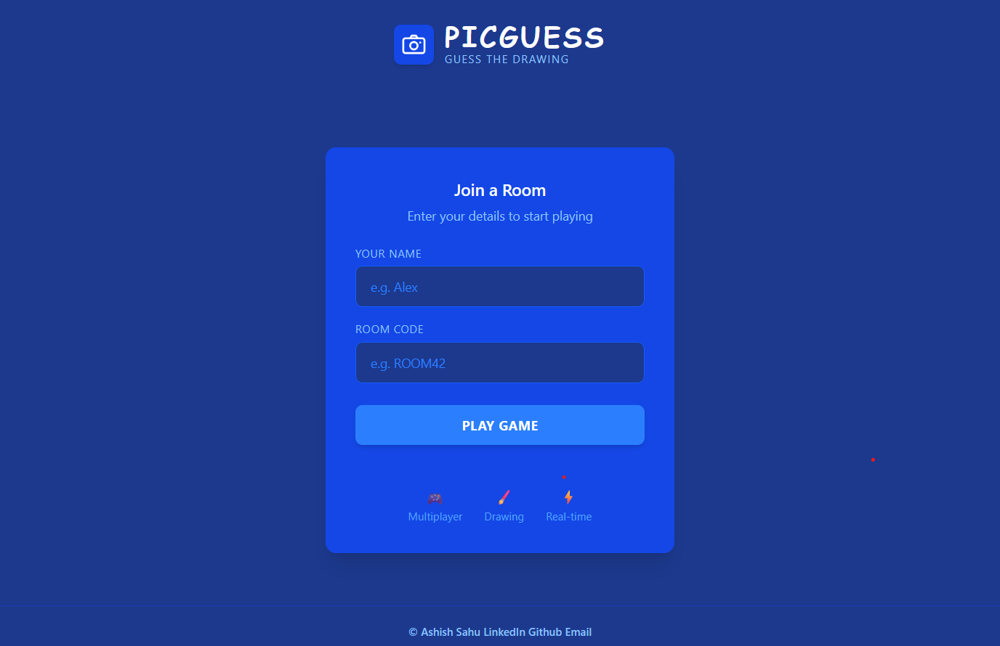
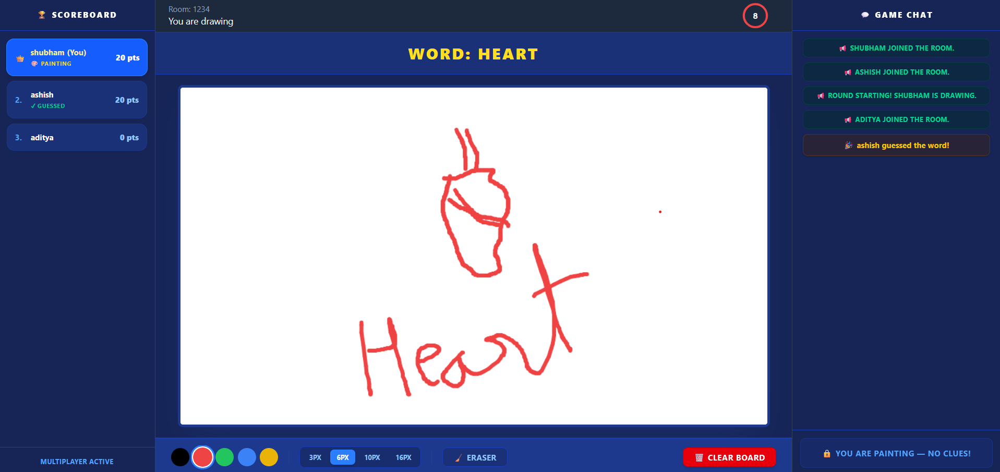

# 🎨 PICGUESS

<div align="center">



# 🖌️ PICGUESS

### Real-Time Multiplayer Drawing & Guessing Game

A fun and interactive multiplayer web game where players draw, guess, compete, and enjoy real-time gameplay with friends.

<br/>

[](https://react.dev/)
[](https://nodejs.org/)
[](https://expressjs.com/)
[](https://socket.io/)
[](https://tailwindcss.com/)

<br/>
<br/>

<a href="https://your-frontend-link.vercel.app">
  
</a>

</div>

---

# 📖 About The Project

PICGUESS is a real-time multiplayer drawing and guessing game inspired by games like Skribbl.io where players can create or join rooms, draw random words, and compete by guessing drawings before the timer ends.

The project is built using React.js, Node.js, Express.js, Socket.io, and Tailwind CSS to provide smooth multiplayer gameplay with instant communication between players.

The game focuses heavily on real-time synchronization. Every drawing stroke, chat message, timer update, score change, and player action is instantly synchronized between all connected users using Socket.io.

Players can:

- Join multiplayer rooms
- Draw random words
- Guess through live chat
- Earn points
- Compete in multiple rounds
- View real-time scoreboards

This project helped in understanding:

- Real-time multiplayer architecture
- WebSocket communication
- React state management
- Socket event handling
- Canvas synchronization
- Multiplayer room systems
- Backend event-driven programming

---

# 🌐 Live Demo

<div align="center">

## 🚀 Visit The Project

https://your-frontend-link.vercel.app

</div>

---

# 📸 Screenshots

## 🏠 Join Room Page



---

## 🎮 Gameplay Screen



---

# ✨ Features

- 🎮 Multiplayer room system
- ✏️ Real-time collaborative whiteboard
- 💬 Live chat and guessing system
- 🏆 Dynamic scoreboard
- ⏱️ Round timer system
- 🔄 Automatic drawer rotation
- ⚡ Instant drawing synchronization
- 👥 Room-based multiplayer gameplay
- 📱 Responsive user interface

---

# 🛠️ Tech Stack

<div align="center">

<table width="100%">
<tr>
<td align="center" width="16%">


### React.js

Frontend UI Library

</td>

<td align="center" width="16%">


### Node.js

Backend JavaScript Runtime

</td>

<td align="center" width="16%">


### Express.js

Backend Framework

</td>

<td align="center" width="16%">


### Socket.io

Real-Time Communication

</td>

<td align="center" width="16%">


### Tailwind CSS

Utility-First CSS Framework

</td>

<td align="center" width="16%">


### JavaScript

Programming Language

</td>

</tr>
</table>

</div>

# ⚙️ Installation

## 1️⃣ Clone Repository

```bash
git clone https://github.com/ashishsahu0052/PicGuesser.git
```

```bash
cd PicGuesser
```

---

# ▶️ Run Backend

```bash
cd backend
npm install
npm start
```

Backend runs on:

```bash
http://localhost:3000
```

---

# ▶️ Run Frontend

Open another terminal:

```bash
cd frontend
npm install
npm run dev
```

Frontend runs on:

```bash
http://localhost:5173
```

---

# 📂 Folder Structure

```bash
PICGUESS/
│
├── frontend/
│   ├── src/
│   ├── public/
│   └── package.json
│
├── backend/
│   ├── app.js
│   └── package.json
│
├── screenshots/
│
└── README.md
```

---

# 🎮 Gameplay Flow

1. Enter your name and room code
2. Join the multiplayer room
3. Wait for players to connect
4. One player becomes the drawer
5. Draw the assigned word
6. Other players guess using chat
7. Correct guesses earn points
8. Timer automatically ends rounds
9. Highest score wins

---

# ⚡ Real-Time Features

Socket.io is used for:

- Live drawing synchronization
- Instant chat updates
- Multiplayer room communication
- Real-time score updates
- Timer synchronization
- Round synchronization

---

# 🔮 Future Improvements

- 🔐 Authentication System
- 🌎 Public Matchmaking
- 📊 Global Leaderboards
- 🔊 Sound Effects
- 😊 Emoji Reactions
- 📱 Better Mobile Support
- 🎨 More Drawing Tools
- 🗄️ Database Integration

---

# 👨‍💻 Author

<div align="center">

# Ashish

[](https://github.com/ashishsahu0052)

[](https://linkedin.com/in/yourprofile)

[](mailto:youremail@example.com)

</div>

---

# 📄 License

This project is licensed under the Ashish.

---

# ⭐ Support

If you liked this project, give it a ⭐ on GitHub.
